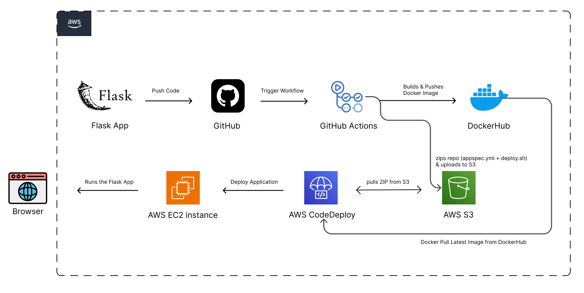

# 🚀 CI/CD Pipeline Project using GitHub Actions, Docker, AWS EC2, S3 & CodeDeploy

This is my first CI/CD project! I built a complete CI/CD pipeline and designed the architecture to automate the deployment of a containerized **Flask web application** using GitHub Actions and AWS services.

---

## 📌 Tech Stack

- **Flask (Python)**
- **Docker**
- **GitHub Actions**
- **AWS EC2**
- **AWS S3**
- **AWS CodeDeploy**

---

## 🧱 Architecture

Here’s a simplified overview of the architecture:

---

## ⚙️ CI/CD Workflow Overview

### ✅ Continuous Integration (CI) – GitHub Actions

- Triggered on push to the `main` branch.
- Builds and tests the Flask application.
- Creates a Docker image and pushes it to Docker Hub.
- Uploads deployment files (`appspec.yml`, `deploy.sh`, etc.) to an S3 bucket.

### 🚀 Continuous Deployment (CD) – AWS CodeDeploy

- Triggers deployment to the EC2 instance.
- Pulls updated files from the S3 bucket.
- Executes `appspec.yml` lifecycle hooks.
- Runs `deploy.sh` on the EC2 instance to:
  - Pull the latest Docker image from Docker Hub.
  - Stop the running container (if any).
  - Start a new container with the updated Flask app.

